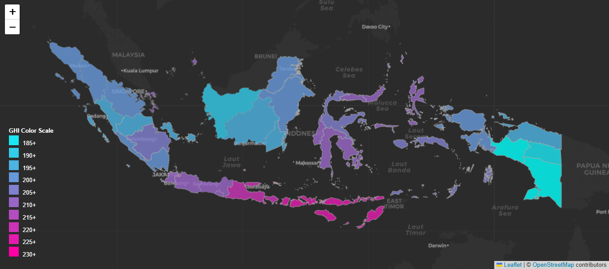
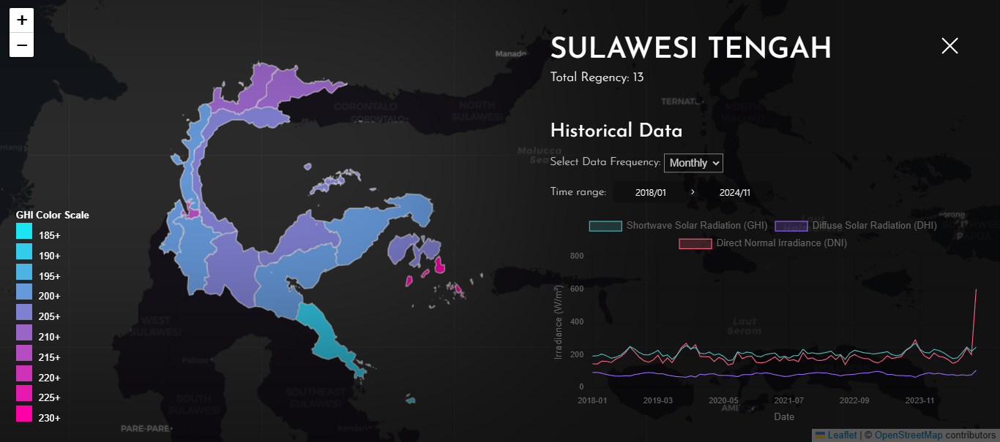

# 🗺️ Indonesia Energy Map

[](https://reactjs.org/)
[](https://vitejs.dev/)
[](https://leafletjs.com/)

An interactive web application that visualizes potential energy data across different regions in Indonesia. This project provides real-time mapping and data visualization capabilities to help users understand energy distribution patterns at both provincial and district levels.




## ✨ Features

- 🗺️ Interactive map visualization using Leaflet
- 📊 Dynamic data visualization with charts
- 📅 Flexible date range selection for temporal analysis
- 🔄 Multiple data frequency views:
  - Daily aggregation
  - Monthly trends
  - Yearly overview
- 🏘️ Hierarchical data navigation:
  - Province-level overview
  - District-level details
- 📱 Responsive design for all devices
- ⚡ Fast data loading and rendering

## 🛠️ Technology Stack

### Core Technologies
- **Frontend Framework:** React 18.3
- **Build Tool:** Vite 4
- **Map Library:** Leaflet 1.9.4 & React-Leaflet 4.2
- **State Management:** React Hooks & Context

### UI Components & Data Handling
- **Date Handling:** 
  - date-fns
  - react-datepicker
  - react-multi-date-picker
- **UI Framework:** Material-UI (MUI X-Date-Pickers)
- **Code Quality:** ESLint 9

### API Services & Data Sources
- **Map Data:** GeoJSON format for Indonesia's administrative boundaries
- **Energy Data Source:** 
  - Primary data sourced from [Open-Meteo](https://open-meteo.com/) API
  - Data aggregated into Daily, Monthly, and Yearly statistics
  - Processed and stored in structured JSON format
- **Data Processing:**
  - Raw weather data aggregated into energy potential calculations
  - Hierarchical structure: Province → District → Detail
  - Local JSON storage format: 
    ```
    /dataset/Provinsi/{province_name}/{province_name}_{frequency}.json
    /dataset/Provinsi/{province_name}/{district_name}/{district_name}_{frequency}.json
    ```

## Project Structure

```
├── public/
│   ├── dataset/            # Data files for provinces and districts
│   │   ├── Provinsi/       # Provincial level data
│   │   └── geojson/       # Geographic data files
├── src/
│   ├── components/
│   │   ├── dataVisual/    # Data visualization components
│   │   └── leafLetMap/    # Map related components
│   ├── assets/
│   │   └── styles/        # CSS stylesheets
│   ├── App.jsx
│   └── main.jsx
```

## 📦 Installation & Setup

1. **Clone the repository**
   ```bash
   git clone https://github.com/zakiibnu723/solar-energy-map.git
   cd solar-energy-map
   ```

2. **Install dependencies**
   ```bash
   npm install
   ```

3. **Start development server**
   ```bash
   npm run dev
   ```

4. **Build for production**
   ```bash
   npm run build
   ```

## 🚀 Available Scripts

- `npm run dev` - Start development server at localhost:5173
- `npm run build` - Create production build
- `npm run lint` - Run ESLint for code quality
- `npm run preview` - Preview production build locally

## 📊 Data Structure

### API Response Format
```json
{
  "location": "PROVINCE_NAME",
  "type": "FREQUENCY",
  "data": {
    "dates": ["2025-01-01", ...],
    "values": [100, ...],
    "metadata": {
      "unit": "kWh",
      "source": "..."
    }
  }
}
```

### File Organization
```
public/dataset/
├── Provinsi/
│   ├── PROVINCE_NAME/
│   │   ├── PROVINCE_NAME_Daily.json
│   │   ├── PROVINCE_NAME_Monthly.json
│   │   ├── PROVINCE_NAME_Yearly.json
│   │   └── DISTRICT_NAME/
│   │       ├── DISTRICT_NAME_Daily.json
│   │       ├── DISTRICT_NAME_Monthly.json
│   │       └── DISTRICT_NAME_Yearly.json
└── geojson/
    ├── kab-37.geojson      # District boundaries
    └── prov-37-simplified.geojson  # Province boundaries
```

## 🤝 Contributing

We welcome contributions! Here's how you can help:

1. Fork the repository
2. Create your feature branch (`git checkout -b feature/AmazingFeature`)
3. Commit your changes (`git commit -m 'Add some AmazingFeature'`)
4. Push to the branch (`git push origin feature/AmazingFeature`)
5. Open a Pull Request

<!-- ## 📝 License

This project is licensed under the MIT License - see the [LICENSE](LICENSE) file for details. -->

<!-- ## 🙏 Acknowledgments

- Data provided by [Your Data Source]
- Map boundaries from [GeoJSON Source]
- Icons and design inspiration from [Design Source] -->
