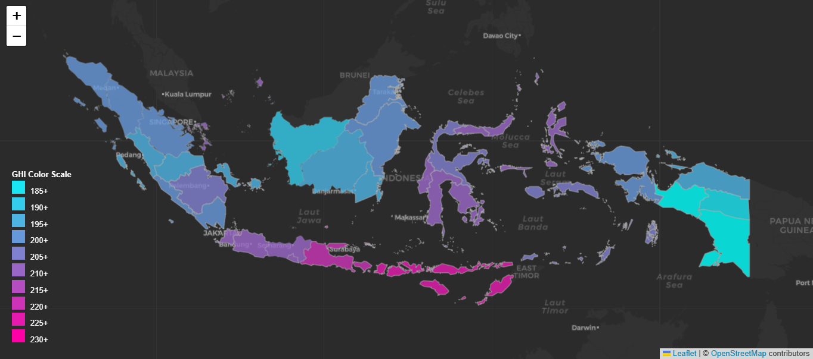
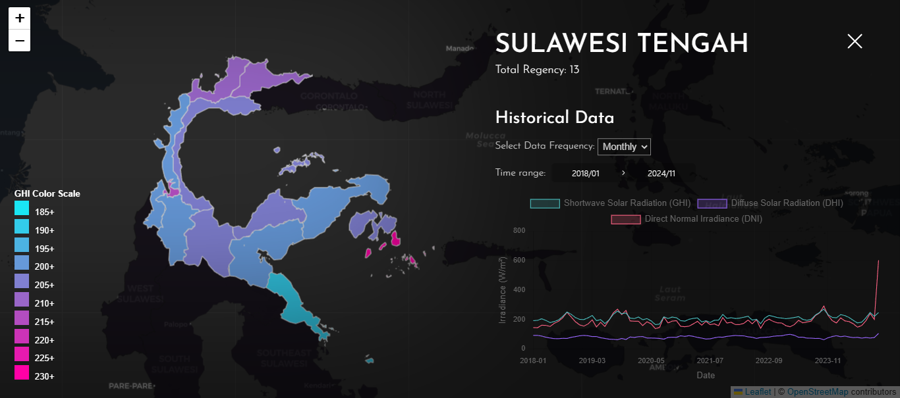

# 🗺️ Indonesia Solar Energy Map

[](https://nextjs.org/)
[](https://react.org/)
[](https://prisma.io/)
[](https://typescriptlang.org/)
[](https://leafletjs.com/)

An interactive full-stack geospatial platform that visualizes renewable solar irradiance potential data (GHI, DHI, DNI) across 37 provinces and 514 districts/cities throughout Indonesia. 

Powered by **Next.js App Router**, **Prisma ORM**, and dynamic Leaflet choropleth maps with real-time time-series analytics.




---

## ✨ Features

- 🗺️ **High-Performance Geospatial Choropleth Map:** Smooth, interactive rendering powered by Leaflet with CartoDB Dark basemaps and custom GHI neon gradient scales.
- ⚡ **Zero Request Waterfalls:** Replaced 38+ sequential client waterfalls with single, instant server-side summary endpoints (`/api/solar/provinces-summary`).
- 📦 **On-Demand GeoJSON Delivery:** Server-side feature filtering eliminates the need to download 8.7MB boundaries on client load.
- 📊 **Dynamic Time-Series Visualizer:** Native Chart.js integration with GHI (Global Horizontal Irradiance), DHI (Diffuse Horizontal Irradiance), and DNI (Direct Normal Irradiance) metrics.
- 📅 **Interactive Temporal Filters:** Seamless Daily, Monthly, and Yearly frequency views with custom frosted glass date-range pickers.
- 📱 **Adaptive Responsive Design:** Desktop HUD side-drawer automatically converts into a collapsible bottom-sheet on mobile and tablet devices.
- 🗄️ **Prisma ORM & Supabase-Ready:** Local SQLite database for zero-config offline execution, ready to switch to Supabase/PostgreSQL with 1 line of configuration.

---

## 🛠️ Technology Stack

### Full-Stack Architecture
- **Framework:** Next.js 16+ (App Router, Server Components & Dynamic Route Handlers)
- **Database & ORM:** Prisma ORM with SQLite (Local) / PostgreSQL (Supabase-ready)
- **Language:** TypeScript
- **Mapping Engine:** Leaflet & React-Leaflet
- **Data Visualization:** Chart.js & React-Chartjs-2
- **Icons & Styling:** Lucide React, Josefin Sans Typography, Vanilla CSS Dark Theme

### Data Sources
- **Solar Irradiance:** Open-Meteo Historical Archive API (2018–2024)
- **Administrative Boundaries:** Simplified Indonesian Provincial and Regency GeoJSON Boundaries
- **Geocoding:** LocationIQ

---

## 📁 Project Structure

```
├── prisma/
│   ├── schema.prisma              # Relational models (Province, District, SolarData)
│   ├── seed.ts                    # Database ingestion script
│   └── dev.db                     # Local SQLite database
├── src/
│   ├── app/
│   │   ├── api/
│   │   │   ├── solar/             # Summary & historical time-series endpoints
│   │   │   └── geojson/           # Province & on-demand district GeoJSON endpoints
│   │   ├── layout.tsx             # Root layout with metadata & fonts
│   │   ├── page.tsx               # Dynamic Leaflet map client page
│   │   └── globals.css            # Dark/cyberpunk styling & responsive layout
│   ├── components/
│   │   ├── map/                   # LeafletMap, ProvLayer, KabLayer, Legend
│   │   └── visual/                # DataVisual HUD, ChartComponent, CustomDateRangePicker
│   └── lib/
│       └── prisma.ts              # Singleton Prisma client
└── public/
    └── geojson/                   # GeoJSON boundary source data
```

---

## 📦 Installation & Setup

1. **Clone the repository**
   ```bash
   git clone https://github.com/zakiibnu723/solar-energy-map.git
   cd solar-energy-map
   ```

2. **Install dependencies**
   ```bash
   npm install
   ```

3. **Set up Environment**
   ```bash
   cp .env.example .env
   ```

4. **Initialize Database & Seed Data**
   ```bash
   npx prisma db push
   npm run prisma:seed
   ```

5. **Start Development Server**
   ```bash
   npm run dev
   ```
   Open [http://localhost:3000](http://localhost:3000) in your browser.

6. **Build for Production**
   ```bash
   npm run build
   npm run start
   ```

---

## 🚀 Available Scripts

- `npm run dev` - Starts the Next.js development server with Turbopack
- `npm run build` - Builds optimized production bundle
- `npm run start` - Starts production server
- `npm run prisma:seed` - Seeds the database with all Indonesian solar data

---

## 📝 License

This project is licensed under the MIT License.
